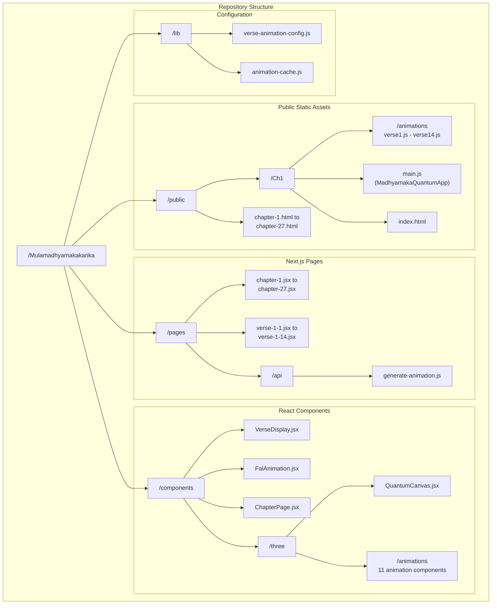
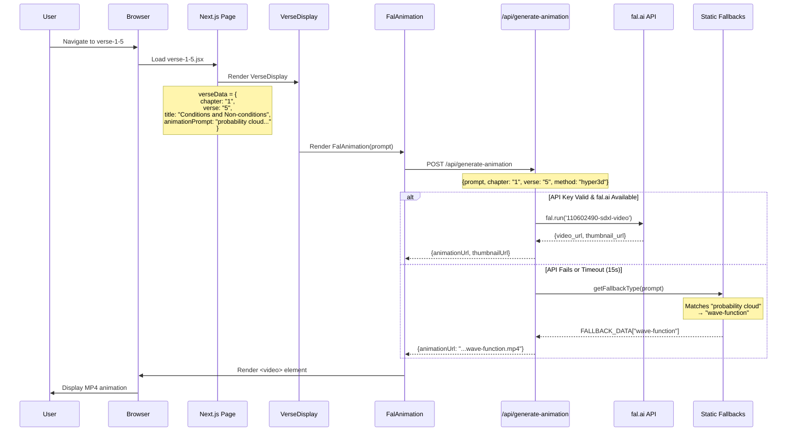
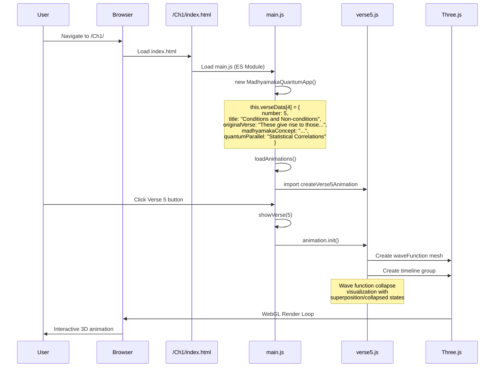
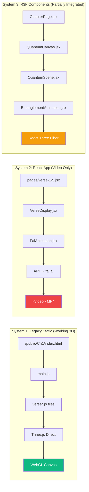
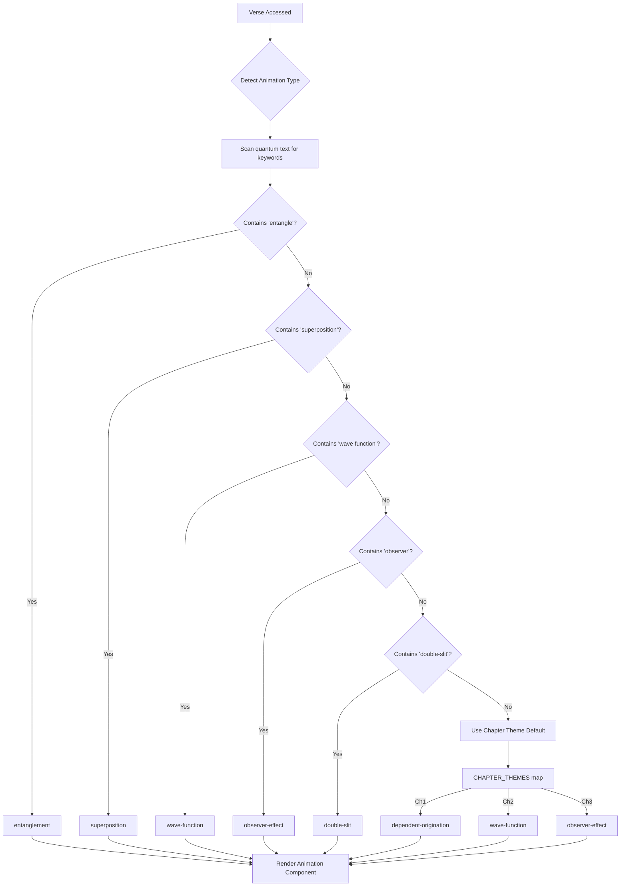

# 🎬 Animation Workflow Analysis & Improvement Plan

**Analysis Date:** December 2024  
**Prepared for:** Verse Animation Regeneration Project

---

## 1. Current Repository Structure



---

## 2. Chapter 1, Verse 5 - Technical Workflow

### How It Currently Works



### Alternative Path: Static HTML (Legacy)



---

## 3. Verse Content Data Structure

### Verse Data Sources (Multiple Locations!)

| Source | Location | Contents | Used By |
|--------|----------|----------|---------|
| **Static Verse Pages** | `pages/verse-1-5.jsx` | `verseText`, `madhyamakaConcept`, `quantumPhysicsParallel`, `analysis`, `animationPrompt` | `VerseDisplay.jsx` |
| **Legacy Main.js** | `public/Ch1/main.js` | `originalVerse`, `madhyamakaConcept`, `quantumParallel`, `example`, `deeperDive` (Q&A) | Static HTML app |
| **Chapter Script** | `scripts/generate-chapter-pages.js` | `title`, `summary`, `quantum` per verse | Page generation |
| **Config** | `lib/verse-animation-config.js` | `animationType`, `theme`, chapter-level config | `ChapterPage.jsx` |

### Example: Verse 1.5 Data

```javascript
// From pages/verse-1-5.jsx
{
  chapter: "1",
  verse: "5",
  title: "Conditions and Non-conditions",
  verseText: "Since something is born in dependence upon them, then they are known as 'conditions'. As long as it is not born, why are they not non-conditions?",
  madhyamakaConcept: "Conditions are conventionally designated based on dependent origination, questioning their status without arising.",
  quantumPhysicsParallel: "Wave Function and Measurement: Potential states actualized by measurement.",
  analysis: "The wave function represents potential, actualized by measurement, paralleling conditions' designation.",
  animationPrompt: "A probability cloud (wave function) around an atom in 3D. Measurement (probe approaching) collapses it to a point..."
}

// From public/Ch1/main.js (more detailed)
{
  number: 5,
  title: "Conditions and Non-conditions",
  originalVerse: "These give rise to those, <br> So these are called conditions...",
  madhyamakaConcept: "Conditions are defined relationally and conventionally based on observed regularities, not inherent power.",
  quantumParallel: "Statistical Correlations / Regularities in Quantum Mechanics",
  example: "We call clouds 'conditions' for rain because we regularly observe rain following clouds...",
  deeperDive: [
    { question: "How are conditions defined if not by inherent power?", answer: "..." },
    { question: "What is the meaning of the challenge in the last two lines?", answer: "..." },
    { question: "How does this relate to scientific explanation?", answer: "..." }
  ]
}
```

---

## 4. Animation System Architecture

### Current Dual System Problem



### Animation Type Detection Flow



---

## 5. Files Involved in Animation Generation

### For Chapter 1, Verse 5 Specifically:

| File | Role | Key Content |
|------|------|-------------|
| `pages/verse-1-5.jsx` | Page definition | verseData object with animationPrompt |
| `components/VerseDisplay.jsx` | Display wrapper | Renders FalAnimation + explanations |
| `components/FalAnimation.jsx` | Animation fetcher | Calls API, displays video/fallback |
| `pages/api/generate-animation.js` | API endpoint | Calls fal.ai, manages cache & fallbacks |
| `lib/verse-animation-config.js` | Config mapper | Maps verse → animation type |
| `public/Ch1/animations/verse5.js` | Legacy animation | Real Three.js wave function code |
| `public/Ch1/main.js` | Legacy orchestrator | Contains detailed verse data + Q&A |
| `components/three/QuantumCanvas.jsx` | R3F wrapper | Modern Three.js canvas |
| `components/three/animations/WaveFunctionAnimation.jsx` | R3F animation | React Three Fiber version |

---

## 6. Key Observations

### Strengths
1. **Rich Content**: Detailed verse explanations with Q&A in legacy system
2. **Multiple Animation Types**: 11 quantum concept animations defined
3. **Modern Infrastructure**: React Three Fiber components exist
4. **Fallback System**: Graceful degradation when fal.ai fails

### Gaps
1. **Data Duplication**: Same verse content in 3-4 places
2. **System Disconnect**: React app uses videos, not real 3D
3. **Incomplete R3F Integration**: QuantumCanvas exists but not fully used
4. **No Centralized Verse Database**: Content scattered across files
5. **Manual Animation Mapping**: animationPrompt written by hand

---

## 7. Animation Prompt → 3D Mapping

Current prompts are **manually written** and **not structured**:

```javascript
// Current (unstructured)
animationPrompt: "A probability cloud (wave function) around an atom in 3D. Measurement (probe approaching) collapses it to a point; without measurement, it evolves as a cloud."

// What's needed (structured)
animationSpec: {
  concept: "wave-function-collapse",
  elements: ["probability_cloud", "atom_core", "measurement_probe"],
  behaviors: ["collapse_on_measurement", "evolve_as_cloud"],
  interactions: ["toggle_observation"],
  colors: { primary: "#4b7bec", collapsed: "#e74c3c" }
}
```

---

## 8. Next Steps Summary

The current system has **good foundations but poor integration**:
- Legacy 3D animations are excellent but isolated
- React app exists but uses videos instead of 3D
- R3F components exist but not connected to verse pages
- Verse content is scattered and duplicated

**Key insight**: The year-old animations in `public/Ch1/animations/` are actually the best quality - they just need to be properly integrated with the modern React stack.
