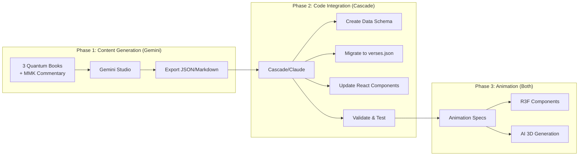
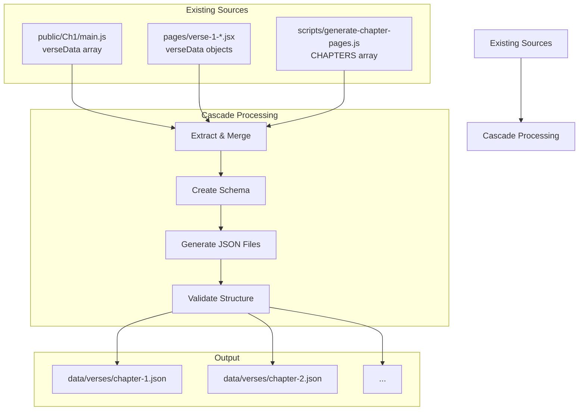

# 🤖 Gemini Studio Integration Workflow

**Goal:** Leverage your existing Gemini Studio research (3 quantum physics books + MMK) to generate accurate verse content and animation specifications.

---

## Can Cascade Help Generate Verses Like Gemini?

### Short Answer: **Partially Yes, But Differently**

| Capability | Gemini Studio | Cascade (Claude) |
|------------|---------------|------------------|
| **Upload & Analyze Books** | ✅ Native (1M+ context) | ❌ No file upload |
| **Reference Your PDFs** | ✅ Direct access | ❌ Need exported content |
| **Generate Structured Output** | ✅ Yes | ✅ Yes |
| **Code Generation** | ⭐⭐⭐ Good | ⭐⭐⭐⭐⭐ Excellent |
| **Animation Specs** | ⭐⭐⭐ Good | ⭐⭐⭐⭐ Very Good |
| **Integration with Codebase** | ❌ Manual | ✅ Direct file editing |

### Best Strategy: **Hybrid Workflow**



---

## Full Workflow: Gemini → Cascade Pipeline

### Step 1: Export Gemini Research

In Gemini Studio, create a structured export for each verse:

```markdown
## Verse 1.5: Conditions and Non-conditions

### Original Sanskrit
pratyayebhyaḥ samutpannaṃ nōtpannaṃ tat svabhāvataḥ |
svabhāvataś ca yan nōtpannaṃ kutaḥ pratyaya-saṃbhavaḥ ||

### English Translation
Since something is born in dependence upon them, then they are known as 'conditions'. 
As long as it is not born, why are they not non-conditions?

### Madhyamaka Analysis
[Your Gemini-generated analysis from the books]

### Quantum Physics Parallel
**Primary Concept:** Wave Function Collapse
**From Book:** [Which of your 3 books]
**Connection:** [How the concepts parallel]

### Animation Specification
- **Type:** wave-function
- **Visual Elements:** probability cloud, measurement probe, collapse effect
- **Interactions:** toggle observation state
- **Colors:** quantum blue (#4b7bec) → collapsed red (#e74c3c)
```

### Step 2: Create Master Prompt for Gemini Batch Processing

```
You have access to three quantum physics books and MMK commentary.

For each verse of the Mūlamadhyamakakārikā, generate a JSON object with this exact structure:

{
  "chapter": 1,
  "verse": 5,
  "sanskrit": "pratyayebhyaḥ samutpannaṃ...",
  "translation": "Since something is born in dependence...",
  "title": "Conditions and Non-conditions",
  "madhyamakaAnalysis": {
    "concept": "Conditions are conventionally designated...",
    "keyTerms": ["pratyaya", "svabhāva", "utpanna"],
    "philosophicalImplication": "..."
  },
  "quantumParallel": {
    "primaryConcept": "Wave Function Collapse",
    "sourceBook": "Book Title",
    "pageReference": "pp. 123-125",
    "explanation": "The wave function represents...",
    "equation": "ψ → |ψ_n⟩ upon measurement"
  },
  "animationSpec": {
    "type": "wave-function",
    "elements": ["probability_cloud", "measurement_probe", "atom_core"],
    "behaviors": ["evolve_superposition", "collapse_on_measurement"],
    "interactions": [
      {"trigger": "click", "action": "toggle_observation"}
    ],
    "colors": {
      "unobserved": "#4b7bec",
      "observed": "#e74c3c",
      "background": "#050520"
    },
    "parameters": {
      "particleCount": 2000,
      "waveIntensity": 1.5,
      "collapseSpeed": 0.5
    }
  },
  "deeperDive": [
    {
      "question": "How are conditions defined if not by inherent power?",
      "answer": "They are defined by observed regularity..."
    }
  ]
}

Process Chapter 1, Verses 1-14.
```

### Step 3: Cascade Integration

Once you have the Gemini exports, I can help with:

1. **Schema Validation** - Ensure JSON is correct
2. **File Generation** - Create `data/verses/chapter-X.json`
3. **Component Updates** - Modify React components to use new data
4. **Animation Mapping** - Connect specs to R3F components

---

## What Cascade Can Do Directly

### Without Gemini Exports

I can help you:

1. **Create the data schema** and file structure
2. **Port existing content** from `main.js` and `verse-*.jsx` files
3. **Build the animation matcher** component
4. **Write R3F animation components** for new concepts
5. **Integrate the existing legacy animations**
6. **Create API endpoints** for verse data
7. **Build batch processing scripts**

### Example: I Can Create This Now

```javascript
// data/verses/chapter-1.json (ported from existing sources)
{
  "chapter": 1,
  "title": "Investigation of Conditions",
  "verseCount": 14,
  "verses": [
    {
      "number": 1,
      "title": "Rejection of Inherent Existence",
      "sanskrit": "na svato nāpi parato na dvābhyāṃ nāpy ahetutaḥ...",
      "translation": "Neither from itself nor from another...",
      // ... ported from main.js
    }
  ]
}
```

---

## Recommended Workflow

### Phase 1: Data Consolidation (Cascade - Now)



### Phase 2: Gemini Enhancement (You + Gemini)

1. Export your existing Gemini conversations
2. Use the master prompt template above
3. Generate enhanced content for each chapter
4. Save as JSON files

### Phase 3: Integration (Cascade)

1. Merge Gemini exports with existing data
2. Update React components to use new data source
3. Connect animation specs to R3F system
4. Test and deploy

---

## Immediate Actions I Can Take

### Option A: Start Data Consolidation Now
I can create the centralized verse database by extracting from existing files:
- Port `main.js` verseData (Chapter 1 - richest data)
- Port `verse-1-*.jsx` files
- Create consistent schema

### Option B: Create Animation Spec Schema
I can design the animation specification format that Gemini should output, ensuring it maps directly to your R3F components.

### Option C: Build Integration Components
I can create:
- `VerseDataProvider` context
- `useVerse(chapter, verse)` hook  
- `AnimationFactory` component
- Updated `VerseDisplay` using new data

---

## Sample: What Enhanced Verse Data Looks Like

```javascript
// After Gemini + Cascade processing
{
  "chapter": 1,
  "verse": 5,
  "meta": {
    "generated": "2024-12-13",
    "sources": ["gemini-export", "main.js", "verse-1-5.jsx"]
  },
  "content": {
    "sanskrit": "tat pratyayebhyaḥ samutpannaṃ pratyayā ity ucyate...",
    "tibetan": "...",
    "translation": "Since something is born in dependence upon them...",
    "title": "Conditions and Non-conditions"
  },
  "analysis": {
    "madhyamaka": {
      "concept": "Conditions are conventionally designated...",
      "keyInsight": "The designation 'condition' depends on the arising...",
      "philosophicalSchool": "Prāsaṅgika Madhyamaka"
    },
    "quantum": {
      "primaryConcept": "Wave Function Collapse",
      "book": "Quantum Mechanics: The Theoretical Minimum",
      "connection": "The wave function represents pure potential...",
      "formula": "ψ(x,t) → |n⟩ upon measurement"
    },
    "synthesis": "Both systems reveal that 'existence' is relational..."
  },
  "animation": {
    "type": "wave-function",
    "component": "WaveFunctionAnimation",
    "fallback": "public/Ch1/animations/verse5.js",
    "config": {
      "particleCount": 2000,
      "waveComplexity": 5,
      "colors": {
        "superposition": "#4b7bec",
        "collapsed": "#e74c3c"
      }
    },
    "interactions": [
      { "id": "collapse", "label": "Collapse Wave Function", "action": "toggle" }
    ]
  },
  "deeperDive": [
    {
      "q": "How are conditions defined if not by inherent power?",
      "a": "They are defined by observed regularity and dependence..."
    },
    {
      "q": "What is the meaning of the challenge in the last two lines?",
      "a": "It's voiced by an opponent: if conditions lack inherent power..."
    },
    {
      "q": "How does this relate to scientific explanation?",
      "a": "It aligns with a Humean view of science describing regularities..."
    }
  ]
}
```

---

## Your Decision Point

**Which would you like me to do first?**

1. **Create the data schema and consolidate existing content** → Start building `data/verses/` now

2. **Design the Gemini prompt template** → So you can batch-generate enhanced content

3. **Build the integration layer** → Connect whatever data source to the UI

4. **All of the above in sequence** → Full implementation starting now

Let me know and I'll begin immediately!
