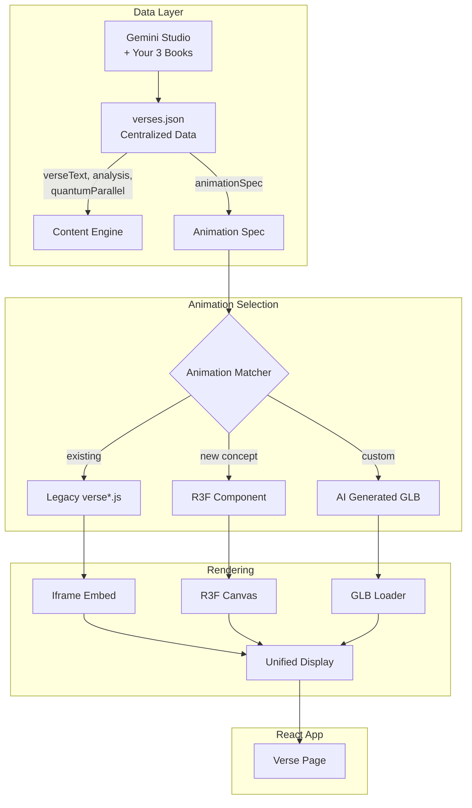
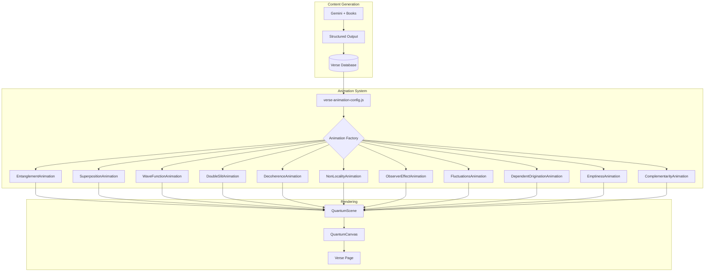
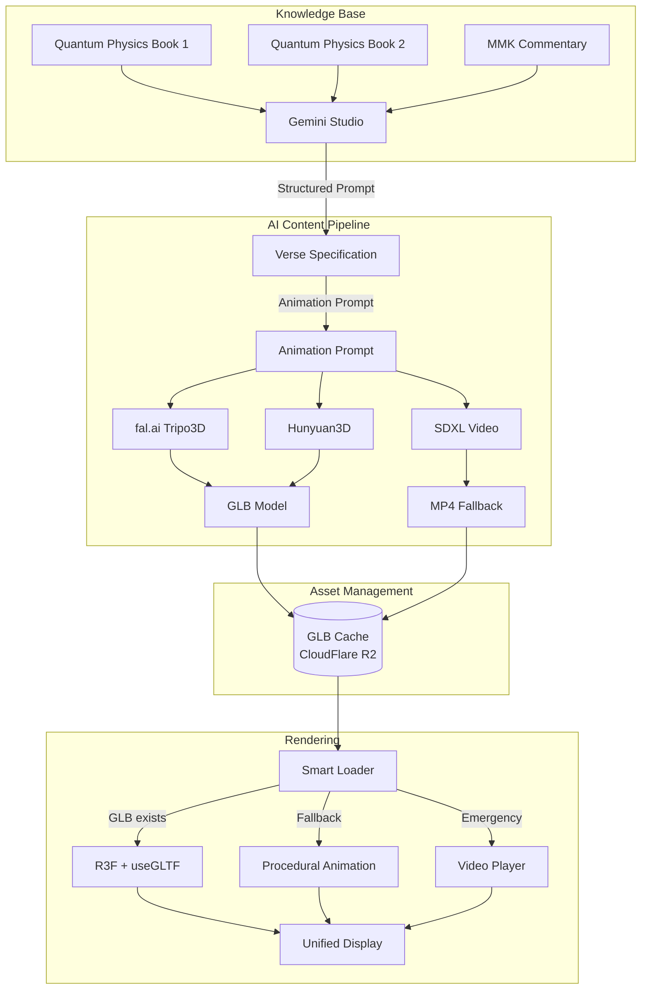

# 🚀 Three Improvement Approaches for Verse Animation Regeneration

**Analysis Date:** December 2024  
**Goal:** Regenerate all verse animations with higher accuracy and minimal rework

---

## Approach Comparison Matrix

| Criteria | Approach 1: Hybrid Integration | Approach 2: Full R3F Migration | Approach 3: AI-Driven Generation |
|----------|-------------------------------|-------------------------------|----------------------------------|
| **Rework Level** | ⭐⭐⭐⭐⭐ Minimal | ⭐⭐ High | ⭐⭐⭐ Medium |
| **Animation Quality** | ⭐⭐⭐⭐ High (existing) | ⭐⭐⭐⭐⭐ Highest | ⭐⭐⭐ Variable |
| **Time to Implement** | 2-3 weeks | 6-8 weeks | 4-5 weeks |
| **Scalability** | ⭐⭐⭐ Medium | ⭐⭐⭐⭐⭐ Excellent | ⭐⭐⭐⭐ Good |
| **Maintenance** | ⭐⭐⭐ Medium | ⭐⭐⭐⭐⭐ Easy | ⭐⭐⭐⭐ Good |
| **Gemini Integration** | ⭐⭐⭐ Partial | ⭐⭐⭐⭐ Good | ⭐⭐⭐⭐⭐ Native |

---

## 📌 APPROACH 1: Hybrid Integration (RECOMMENDED)

### Overview
Keep the existing high-quality Three.js animations from `public/Ch1/animations/` and integrate them into the React app via an iframe or dynamic module loading, while using Gemini/Claude to generate **structured animation specifications** for new/updated verses.

### Architecture



### Implementation Steps

1. **Create Centralized Verse Database** (2 days)
   ```
   /data/verses/
     chapter-1.json  # All 14 verses with full content
     chapter-2.json  # All 25 verses
     ...
     chapter-27.json
   ```

2. **Build Animation Matcher** (3 days)
   - Map each verse to best animation source
   - Priority: Legacy 3D > R3F Component > AI Video

3. **Iframe Integration for Legacy** (2 days)
   - Embed `/Ch1/index.html?verse=5` in React
   - Pass verse selection via postMessage

4. **Gemini Content Pipeline** (5 days)
   - Export your Gemini conversations
   - Parse into structured JSON
   - Validate against verse schema

### Pros
- ✅ **Minimal rework** - Reuses year of animation work
- ✅ **Fast deployment** - 2-3 weeks
- ✅ **High quality** - Legacy animations are excellent
- ✅ **Gemini compatible** - Can use exported content

### Cons
- ⚠️ Iframe adds complexity
- ⚠️ Two rendering systems to maintain
- ⚠️ Limited interactivity between systems

### Estimated Effort: **80-120 hours**

---

## 📌 APPROACH 2: Full React Three Fiber Migration

### Overview
Port ALL legacy `verse*.js` animations to React Three Fiber components, creating a unified modern codebase. Use Gemini to generate enhanced content and new animation parameters.

### Architecture



### Implementation Steps

1. **Port Legacy Animations** (20 days)
   - Convert each `verse*.js` to React component
   - Already started: 11 R3F animations exist
   - Need: ~30 more unique animations

2. **Create Animation Factory** (3 days)
   - Dynamic loading based on verse config
   - Parameter injection for customization

3. **Gemini Content Enhancement** (5 days)
   - Generate richer analysis
   - Create animation parameters per verse

4. **Testing & Polish** (7 days)
   - Performance optimization
   - Mobile responsiveness
   - Animation transitions

### Pros
- ✅ **Single codebase** - No iframe complexity
- ✅ **Modern stack** - React Three Fiber + drei
- ✅ **Better performance** - Optimized rendering
- ✅ **Easier updates** - One system to maintain

### Cons
- ⚠️ **High rework** - 6-8 weeks effort
- ⚠️ Porting may introduce bugs
- ⚠️ Some legacy effects hard to replicate

### Estimated Effort: **240-320 hours**

---

## 📌 APPROACH 3: AI-Driven Generation Pipeline

### Overview
Use Gemini to generate **complete animation specifications** from your books, then use AI (fal.ai Tripo3D, Hunyuan3D) to generate 3D assets, with R3F for rendering.

### Architecture



### Implementation Steps

1. **Gemini Prompt Engineering** (5 days)
   - Design structured output schema
   - Create verse analysis prompt template
   - Generate specs for all 400+ verses

2. **AI Asset Generation Pipeline** (7 days)
   - Set up fal.ai Tripo3D integration
   - Create batch generation script
   - Implement quality validation

3. **Asset Cache & CDN** (3 days)
   - CloudFlare R2 for GLB storage
   - Intelligent preloading

4. **Smart Loader Component** (5 days)
   - GLB → Procedural → Video fallback
   - Loading states & error handling

5. **Regenerate All Verses** (10 days)
   - Batch process through Gemini
   - Generate 3D assets
   - QA and refinement

### Pros
- ✅ **Scalable** - Works for any number of verses
- ✅ **AI-native** - Leverages your Gemini work
- ✅ **Unique content** - Custom 3D per verse
- ✅ **Future-proof** - AI models keep improving

### Cons
- ⚠️ **Variable quality** - AI generation inconsistent
- ⚠️ **Cost** - fal.ai API costs for 400+ verses
- ⚠️ **Latency** - Generation takes time
- ⚠️ **Requires curation** - Human QA needed

### Estimated Effort: **160-200 hours**

---

## 🏆 RECOMMENDATION: Approach 1 (Hybrid Integration)

### Why This is Best for You

1. **Preserves Your Year of Work**
   - The legacy `verse*.js` animations are high quality
   - No need to recreate what already works

2. **Minimum Rework**
   - Focus on integration, not recreation
   - 2-3 weeks vs 6-8 weeks

3. **Gemini Compatible**
   - Your existing Gemini research becomes the content layer
   - Animation selection becomes a mapping problem

4. **Incremental Improvement**
   - Start with Chapter 1 (fully animated)
   - Add R3F components for other chapters
   - AI generation for truly new concepts

### Quick Start Plan

```
Week 1:
├── Day 1-2: Create verses.json schema + Ch1 data
├── Day 3-4: Build AnimationMatcher component  
└── Day 5: Iframe integration for legacy animations

Week 2:
├── Day 1-2: Gemini export → JSON pipeline
├── Day 3-4: Connect to VerseDisplay component
└── Day 5: Testing Chapter 1 end-to-end

Week 3:
├── Day 1-3: Extend to Chapters 2-5
├── Day 4-5: Polish, error handling, mobile
└── Deploy MVP
```

---

## Appendix: Gemini Integration Specifics

### What You Can Do with Gemini Studio Exports

Since you've uploaded 3 books and done extensive analysis:

1. **Export Conversations** → Parse into structured JSON
2. **Generate New Specs** → Use Gemini API programmatically
3. **Create Animation Prompts** → Structured prompts for each verse

### Sample Gemini Prompt Template

```
Given the Mūlamadhyamakakārikā verse:

"{verseText}"

And these quantum physics concepts from the uploaded books:
- [Relevant concept 1]
- [Relevant concept 2]

Generate a JSON animation specification:
{
  "verseRef": "1.5",
  "animationType": "wave-function|entanglement|superposition|...",
  "primaryConcept": "...",
  "quantumParallel": "...",
  "visualElements": ["element1", "element2"],
  "interactions": ["interaction1"],
  "colorScheme": { "primary": "#hex", "secondary": "#hex" },
  "animationNotes": "..."
}
```

This structured output can directly feed your animation system.
